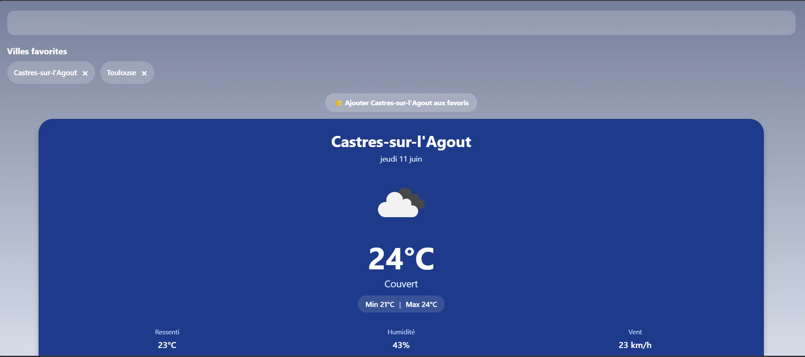
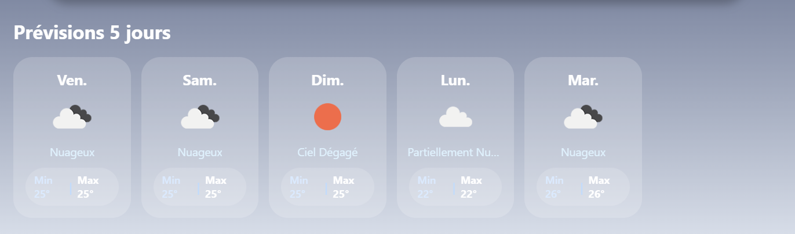
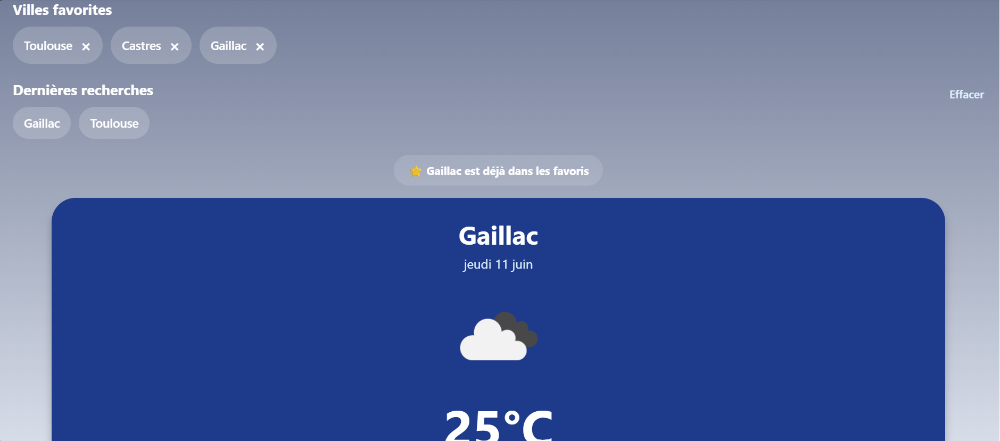
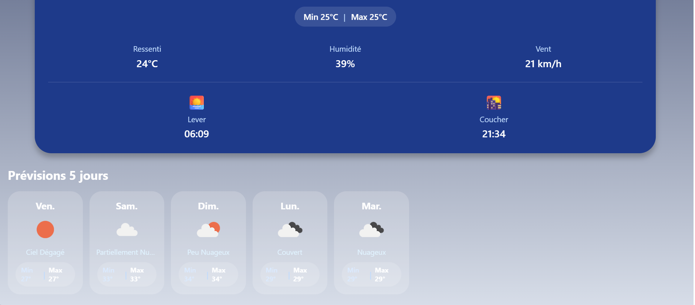

# 🌤️ WeatherApp

Application météo moderne développée avec **React Native**, **Expo** et **TypeScript**.

L'application permet de consulter la météo actuelle de n'importe quelle ville, d'obtenir les prévisions sur 5 jours, d'utiliser la géolocalisation de l'appareil et de sauvegarder ses villes favorites.

---

## ✨ Fonctionnalités

### 🌍 Météo en temps réel

* Géolocalisation automatique
* Recherche de ville
* Température actuelle
* Température ressentie
* Humidité
* Vitesse du vent en km/h
* Température minimale et maximale
* Lever et coucher du soleil

### 📅 Prévisions météo

* Prévisions sur 5 jours
* Icônes météo
* Description des conditions météorologiques
* Températures min/max quotidiennes

### ⭐ Expérience utilisateur

* Villes favorites persistantes
* Historique des recherches
* Sauvegarde locale avec AsyncStorage
* Gestion des erreurs
* Interface responsive
* Fond dynamique selon les conditions météo

---

## 🛠️ Technologies utilisées

### Frontend

* React Native
* Expo
* TypeScript

### Navigation

* Expo Router

### API

* OpenWeatherMap API

### Stockage local

* AsyncStorage

### Géolocalisation

* Expo Location

### Requêtes HTTP

* Axios

---

## 📸 Captures d'écran

### Écran principal



### Prévisions météo



### Favoris et historique



---

## 🚀 Installation

### Cloner le projet

```bash
git clone https://github.com/clems-dev-maker/WeatherApp.git
cd WeatherApp
```

### Installer les dépendances

```bash
npm install
```

### Configurer les variables d'environnement

Créer un fichier :

```env
.env
```

Ajouter :

```env
EXPO_PUBLIC_OPENWEATHER_API_KEY=YOUR_API_KEY
```

### Lancer l'application

```bash
npx expo start
```

---

## 📂 Structure du projet

```text
src
│
├── app
│   └── index.tsx
│
├── components
│   ├── WeatherCard.tsx
│   ├── ForecastCard.tsx
│   ├── SearchBar.tsx
│   ├── FavoriteCities.tsx
│   └── SearchHistory.tsx
│
├── services
│   └── weatherApi.ts
│
├── utils
│   └── weatherTheme.ts
│
└── hooks
```

---

## 🔒 Sécurité

Le fichier `.env` est exclu du dépôt Git afin de protéger les clés API.

Un fichier `.env.example` est fourni pour faciliter la configuration du projet.

---

## 🎯 Améliorations futures

* Mode sombre / clair
* Animations météo
* Qualité de l'air
* Indice UV
* Notifications météo
* Widget écran d'accueil
* Support multilingue

---

## 👨‍💻 Auteur

Développé par **Clément Cathala**

GitHub : https://github.com/clems-dev-maker

---

## 📄 Licence

Projet distribué sous licence MIT.
