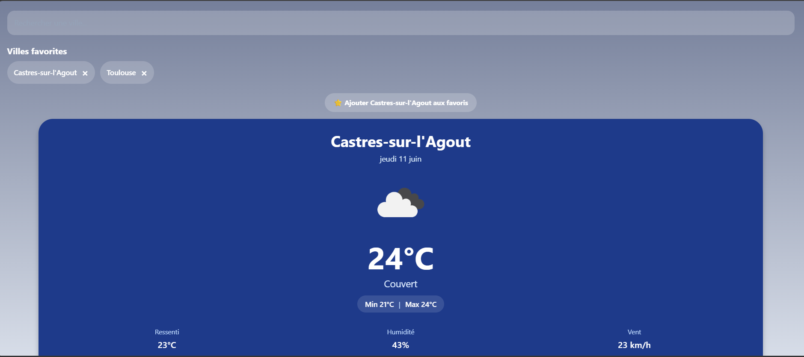
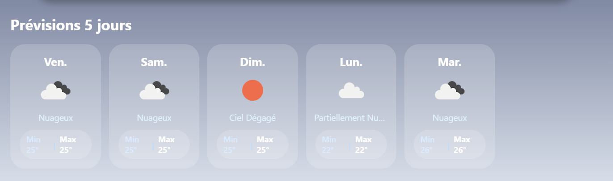
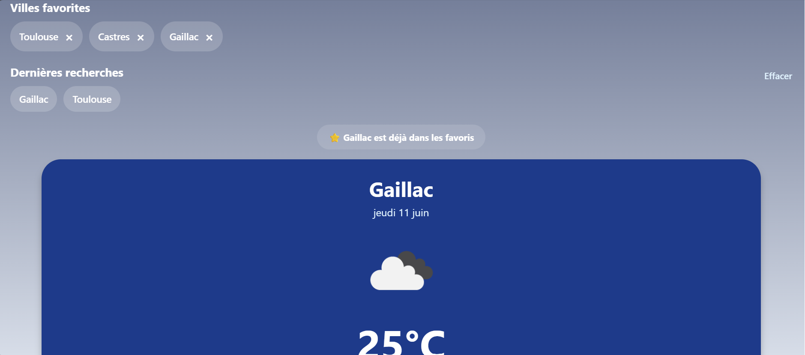
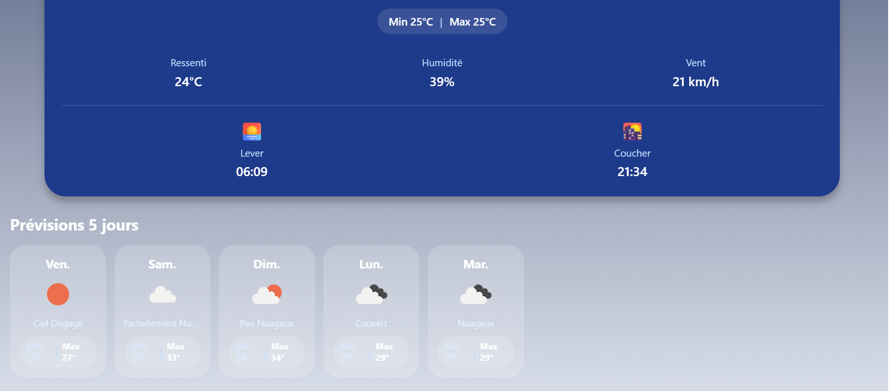

# 🌤️ WeatherApp

Application météo moderne développée avec **React Native**, **Expo** et **TypeScript**.

L'application permet de consulter la météo actuelle de n'importe quelle ville, d'obtenir les prévisions sur 5 jours, d'utiliser la géolocalisation de l'appareil et de sauvegarder ses villes favorites.

---

## ✨ Fonctionnalités

### 🌍 Météo en temps réel

- Géolocalisation automatique
- Recherche de ville
- Température actuelle
- Température ressentie
- Humidité
- Vitesse du vent en km/h
- Température minimale et maximale
- Lever et coucher du soleil

### 📅 Prévisions météo

- Prévisions sur 5 jours
- Icônes météo
- Description des conditions météorologiques
- Températures min/max quotidiennes

### ⭐ Expérience utilisateur

- Villes favorites persistantes
- Historique des recherches
- Sauvegarde locale avec AsyncStorage
- Gestion des erreurs
- Interface responsive
- Fond dynamique selon les conditions météo

---

## 🛠️ Technologies utilisées

### Frontend

- React Native
- Expo
- TypeScript

### Navigation

- Expo Router

### API

- OpenWeatherMap API

### Stockage local

- AsyncStorage

### Géolocalisation

- Expo Location

### Requêtes HTTP

- Axios

---

## 📸 Captures d'écran

### Écran principal



### Prévisions météo



### Favoris et historique





### 🎬 Démonstration


---

## 🚀 Installation

### 1. Cloner le projet

```bash
git clone https://github.com/clems-dev-maker/WeatherApp.git
cd WeatherApp
2. Installer les dépendances
npm install
3. Configurer les variables d'environnement

Créer un fichier .env à la racine du projet :

EXPO_PUBLIC_OPENWEATHER_API_KEY=YOUR_API_KEY

⚠️ Remplacez YOUR_API_KEY par votre propre clé API OpenWeatherMap.

Ne publiez jamais votre clé API directement dans le dépôt Git.

4. Lancer l'application
npx expo start
📂 Structure du projet
src/
│
├── app/
│   └── index.tsx
│
├── components/
│   ├── WeatherCard.tsx
│   ├── ForecastCard.tsx
│   ├── SearchBar.tsx
│   ├── FavoriteCities.tsx
│   └── SearchHistory.tsx
│
├── services/
│   └── weatherApi.ts
│
├── utils/
│   └── weatherTheme.ts
│
└── hooks/
🔒 Sécurité

Le fichier .env est exclu du dépôt Git afin de protéger les clés API.

Un fichier .env.example est fourni afin de faciliter la configuration du projet.

Exemple :

EXPO_PUBLIC_OPENWEATHER_API_KEY=YOUR_API_KEY

⚠️ Ne partagez jamais une clé API personnelle dans un dépôt public.

🎯 Améliorations futures
 Mode sombre / clair
 Animations météo
 Qualité de l'air
 Indice UV
 Notifications météo
 Widget écran d'accueil
 Support multilingue
👨‍💻 Auteur

Développé par Clément Cathala

GitHub : https://github.com/clems-dev-maker
